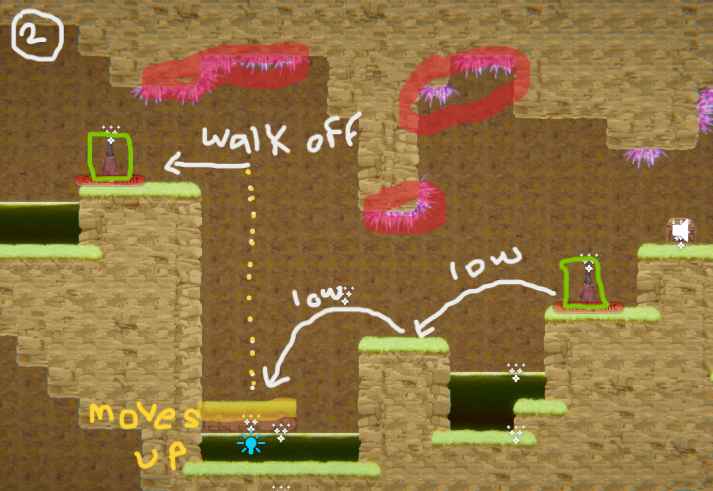
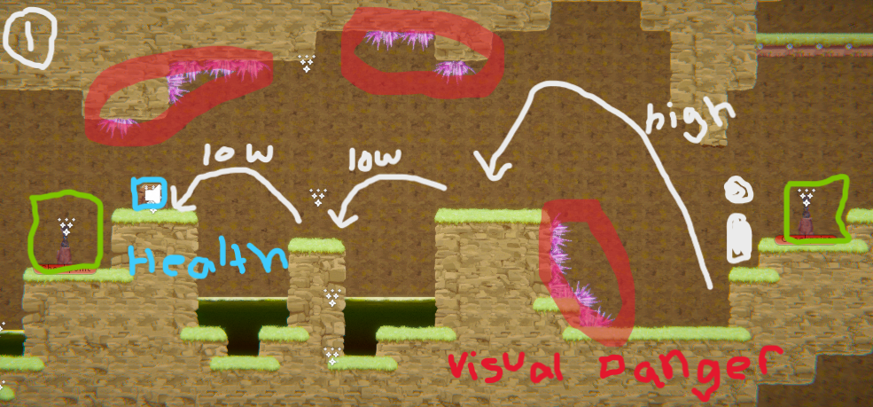

[](https://classroom.github.com/a/YyUO0xtt)
# COMP2150  - Level Design Document
### Name: Chloe Adams
### Student number: 47797401

Your document must include images. To insert an image into your documentation, place it in the "DocImages" folder in this repo, then place the below text where you want the image to appear:

```

```

Example:


## 1. Player Experience (~700 words)
Outline and justify how your level design facilitates the core player experience goals outlined in the assignment spec. Each section should be supported by specific examples and screenshots of your game encounters that highlight design choices made to facilitate that particular experience.

### 1.1. Discovery
What does the player learn? How does your encounter and broader level design facilitate learning in a way that follows good design practice?

In the level I have designed, the player learns a variety of moves that allow them to progress, including the differing utility of low vs high jumps, and ladder climbs. These two dynamics are essential for all three sections of the level, and are taught through varying difficulties. 

Section one of my level, the underground cave system, introduces the importance of accuracy when choosing how high one should jump. The use of spikes are used to clue the player in with the required force of their jump, should they miscalculate, they are punished and either lose a healthpoint, or potentially get set back to the last checkpoint if they land in acid. The start of the encounter allows for error, as the first jump onto the platform only removes one healthpoint if the player misses.
Based on external testing, most players instinctively only used high jumps when they first started out. Because of this, I chose to make the initial jump a highjump, then slowly introduced the players to the concept of low jumps through the use of roof spikes. I opted to introduce acid to the second and third jump, so that if they stuffed up before the checkpoint, they’d have to practice the sequence again. I did this to ensure full competency with the players abilities before making them attempt a harder sequence.

First and Second Sequence comparison;
 


### 1.2. Drama
What is the intensity curve? How does your design facilitate increasing yet modulating intensity, with moments of tension and relief? 


### 1.3. Challenge
What are the main challenges? How have you designed and balanced these challenges to control the difficulty curve and keep the player in the flow channel?

The main challenge is for the player to understand how high they should jump with each obstacle. I’ve implemented measures in each section that punish and reward the player for their choice depending on if it was the right one. For example, in section one, I introduce the player to the spike obstacle. Right off the bat, it is pretty clear that a high jump is needed to clear the platform. However, Should the player choose to do a quick jump, the spikes lining the first platform will harm them, acting as repremandment for their mistake. The use of spikes teaches them to be as precise with their jumps as possible, and also forces the player to follow a very specific jump arc (this adds to the challenge) 

To balance out the difficulty, I have implemented a reasonable amount of checkpoints throughout the section as to not dishearten the player if they make a mistake. The player will get punished, but the checkpoints are there to encourage them to be resilient and complete that section. The reward for each section is a key, so my goal is to ensure that the player wont give up midway. The checkpoints also ensure the player never has to repeat difficult sequences within the section, as some sections have multiple challenging obstacle combinations and it would be unreasonable for me to force the player to keep reliving the same possible mistakes. Once the player gets through a tough sequence, they've proven themselves worthy and should be able to progress.

Another means I’ve used to ensure a fair outcome to the player is to leave a good amount of equippable health packs throughout each of the sections. In some sections, particularly section two, there's many ways to get injured or set back, to the point that even though there are checkpoints in place, a player could simply run out of health and be forced to start all overagain regardless of their progress. Health packs slow down the depletion of health and can even be the make or break in completing the section. Should the player still run out of health, then that's the players own lack of skill. I placed health packs in fair, accessible locations correlating to the previous obstacles, and even placed them in areas as a reward for exploration or risk taking.


### 1.4. Exploration
How does your level design facilitate autonomy and invite the player to explore? How do your aesthetic and layout choices create distinct and memorable spaces and/or places?

## 2. Core Gameplay (~400 words)
A section on Core Gameplay, where storyboards are used to outline how you introduce the player to each of the required gameplay elements in the first section of the game. Storyboards should follow the format provided in lectures.

Storyboards can be combined when multiple mechanics are introduced within a single encounter. Each section should include a sentence or two to briefly justify why you chose to introduce the mechanic/s to the player in that sequence.

You should restructure the headings below to match the order they appear in your level.

### 2.1. Acid

### 2.2. Checkpoints

### 2.3. Chompers

### 2.4. Health Pickups

### 2.5. Keys

### 2.6. Moving Platforms

### 2.7. Passthrough Platforms

### 2.8. Spikes

### 2.9. Spitters

### 2.10. Weapon Pickup (Gun)

### 2.11. Weapon Pickup (Staff)

## 3. Spatiotemporal Design
A section on Spatiotemporal Design, which includes your molecule diagram and annotated level maps (one for each main section of your level). These diagrams may be made digitally or by hand, but must not be created from screenshots of your game. The annotated level maps should show the structure you intend to build, included game elements, and the path the player is expected to take through the level. Examples of these diagrams are included in the level design lectures.

No additional words are necessary for this section (any words should only be within your images/diagrams).
 
### 3.1. Molecule Diagram

### 3.2. Level Map – Section 1

### 3.3.	Level Map – Section 2

### 3.4.	Level Map – Section 3

## 4. Iterative Design (~400 words)
Reflect on how iterative design helped to improve your level. Additional prototypes and design artefacts should be included to demonstrate that you followed an iterative design process (e.g. pictures of paper prototypes, early grey-boxed maps, additional storyboards of later gameplay sequences, etc.). You can also use this section to justify design changes made in Unity after you drew your level design maps shown in section 3. 

You should conclude by highlighting a specific example of an encounter, or another aspect of your level design, that could be improved through further iterative design.

## Generative AI Use Acknowledgement

Use the below table to indicate any Generative AI or writing assistance tools used in creating your document. Please be honest and thorough in your reporting, as this will allow us to give you the marks you have earnt. Place any drafts or other evidence inside this repository. This form and related evidence do not count to your word count.
An example has been included. Please replace this with any actual tools, and add more as necessary.


### Tool Used: ChatGPT
**Nature of Use** Finding relevant design theory.

**Evidence Attached?** Screenshot of ChatGPT conversation included in the folder "GenAI" in this repo.

**Additional Notes:** I used ChatGPT to try and find some more relevant design theory that I could apply to my game. After googling them, however, I found most of them were inaccurate, and some didn't exist. One theory mentioned, however, was useful, and I've incorporated it into my work.

### Tool Used: Example
**Nature of Use** Example Text

**Evidence Attached?** Example Text

**Additional Notes:** Example Text


