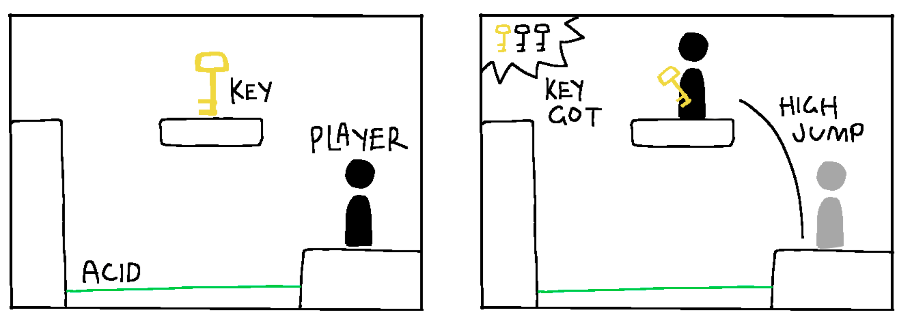
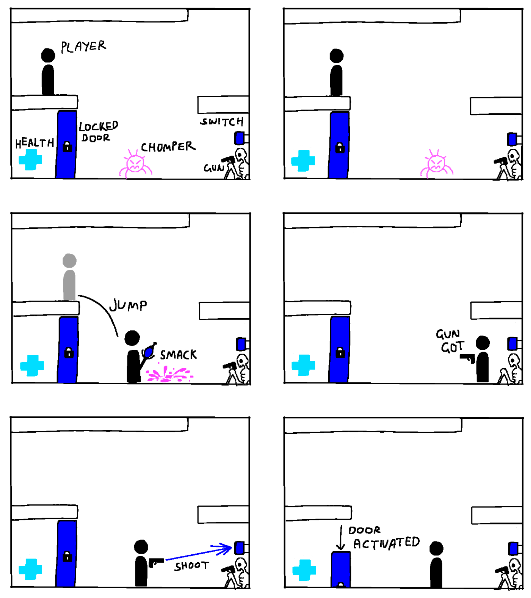

# COMP2150  - Level Design Document
### Name: Chloe Adams
### Student number: 47797401

## 1. Player Experience (~700 words)
Outline and justify how your level design facilitates the core player experience goals outlined in the assignment spec. Each section should be supported by specific examples and screenshots of your game encounters that highlight design choices made to facilitate that particular experience.

### 1.1. Discovery
What does the player learn? How does your encounter and broader level design facilitate learning in a way that follows good design practice?
---

In the level I have designed, the player learns a variety of moves that allow them to progress, including the differing utility of low vs high jumps, and ladder climbs. These two dynamics are essential for all three sections of the level, and are taught through varying difficulties.

Section one of my level, the underground cave system (The Crystal Caves), introduces the importance of accuracy when choosing how high one should jump. The use of spikes are used to clue the player in with the required force of their jump, should they miscalculate, they are punished and either lose a healthpoint, or potentially get set back to the last checkpoint if they land in acid. The start of the encounter allows for error, as the first jump onto the platform only removes one healthpoint if the player misses.

Based on external testing, most players instinctively only used high jumps when they first started out. Because of this, I chose to make the initial jump a highjump, then slowly introduced the players to the concept of low jumps through the use of roof spikes. I opted to introduce acid to the second and third jump, so that if they stuffed up before the checkpoint, they’d have to practice the sequence again. I did this to ensure full competency with the players abilities before making them attempt a harder sequence.

First and Second Sequence comparison -->
(keep in mind this section goes from right to left.)

As for the ladder climb, the concept is first introduced to the player in the third encounter of Section One, in a simple, low stakes environment. There are no immediate dangers, allowing the player to take their time, stuff up and keep trying. As relevant to the challenge aspect of the player experience, the player in future encounters a higher stakes, (and higher altitude) reimagining of the ladder climb they previously learned in Encounter Three of Section Three, only now there's a spitter added to create a sense of urgency and prevent loitering. The player also dies if they fall from the height, forcing the player to execute both the accuracy they learned through the first and the efficient ladder climbing they learned. Through repeating similar structures in my game, players learn efficiency alongside their new found precision.

First Ladder Climb (Section One Encounter Three) vs Second Ladder Climb (Section Three Encounter Three) -->

### 1.2. Drama
What is the intensity curve? How does your design facilitate increasing yet modulating intensity, with moments of tension and relief? 

I have implemented drama in my game through my use of tension and relief. Encounter Three of Section Three is the best example of this, as it is intended to be the most intense part of my level, but also give the greatest triumph when completed. I’ve created this graph to demonstrate the intensity curve;

### 1.3. Challenge
What are the main challenges? How have you designed and balanced these challenges to control the difficulty curve and keep the player in the flow channel?
---

The main challenge is for the player to understand how high they should jump with each obstacle. I’ve implemented measures in each section that punish and reward the player for their choice depending on if it was the right one. For example, in section one, I introduce the player to the spike obstacle. Right off the bat, it is pretty clear that a high jump is needed to clear the platform. However, Should the player choose to do a quick jump, the spikes lining the first platform will harm them, acting as repremandment for their mistake. The use of spikes teaches them to be as precise with their jumps as possible, and also forces the player to follow a very specific jump arc (this adds to the challenge) 

To balance out the difficulty, I have implemented a reasonable amount of checkpoints throughout the section as to not dishearten the player if they make a mistake. The player will get punished, but the checkpoints are there to encourage them to be resilient and complete that section. The reward for each section is a key, so my goal is to ensure that the player wont give up midway. The checkpoints also ensure the player never has to repeat difficult sequences within the section, as some sections have multiple challenging obstacle combinations and it would be unreasonable for me to force the player to keep reliving the same possible mistakes. Once the player gets through a tough sequence, they've proven themselves worthy and should be able to progress.

Another means I’ve used to ensure a fair outcome to the player is to leave a good amount of equippable health packs throughout each of the sections. In some sections, particularly section two, there's many ways to get injured or set back, to the point that even though there are checkpoints in place, a player could simply run out of health and be forced to start all over again regardless of their progress. Health packs slow down the depletion of health and can even be the make or break in completing the section. Should the player still run out of health, then that's the players own lack of skill. I placed health packs in fair, accessible locations correlating to the previous obstacles, and even placed them in areas as a reward for exploration or risk taking.

### 1.4. Exploration
How does your level design facilitate autonomy and invite the player to explore? How do your aesthetic and layout choices create distinct and memorable spaces and/or places?

I have chosen to opt for a more open world style of level design to allow the player to explore each section at their own pace. Although some sections are arguably more complicated than others, each section introduces a concept then has the player develop their abilities as that section progresses. I have three sections; The Crystal Cave, The Mud Caves and The Skylands. Each of these sections are aesthetically differentiated through lighting, decorations and tile placement, as well as location to give each section its unique appeal. I’ve put rewards all over my level to encourage exploration, and ensured at no point does the player get trapped anywhere they can’t escape.

To ensure that the learning curve for the player is always reasonable,  each of  the fundamental mechanics (such as ladder jumps and low/high jumps) are re-introduced at the start of each encounter so the player is never lost or punished for completing the sections in their own order– This will hopefully elevate the players experience as they have a sense of autonomy and are able to pick and choose which key to go for when. There is an expected path for them to take based on the difficulty for inexperienced players, but should a more experienced player wish, they have the freedom to roam. (Through Playtesting I found that my dad, a less experienced player, opted for the more linear route I expected and didn’t have as much of an urge to explore, whilst my boyfriend, a veteran platformer, was eager to explore and discover every minute secret my level had to offer.)

## 2. Core Gameplay (~400 words)
A section on Core Gameplay, where storyboards are used to outline how you introduce the player to each of the required gameplay elements in the first section of the game. Storyboards should follow the format provided in lectures.

Storyboards can be combined when multiple mechanics are introduced within a single encounter. Each section should include a sentence or two to briefly justify why you chose to introduce the mechanic/s to the player in that sequence.

You should restructure the headings below to match the order they appear in your level.

### 2.1. Weapon Pickup (Staff) + Chompers

### 2.2. Passthrough Platforms + Spikes

### 2.3. Checkpoints + Acid + Spikes + Health Pickups

### 2.4. Moving Platforms

### 2.5. Keys

### 2.6. Spitters

### 2.7. Weapon Pickup (Gun)

### 2.8. Checkpoints pt.2
This isn't the first introduction to checkpoints but I wanted to highlight a good use of them in the intrest of the player; In The Skylands, It would get very frustrating for the player to get knocked off by a spitter, or even just miss a jump and land back on the grounds, as this would force the player to climb all the way back up. Checkpoints are only helpful when the player touches acid, so to combat the potential annoyance of the player, I removed the graphics and animations from the acid and just used it as a Trasparent hitbox that could recent the pkayer back in the skylands incase they fell.

## 3. Spatiotemporal Design
A section on Spatiotemporal Design, which includes your molecule diagram and annotated level maps (one for each main section of your level). These diagrams may be made digitally or by hand, but must not be created from screenshots of your game. The annotated level maps should show the structure you intend to build, included game elements, and the path the player is expected to take through the level. Examples of these diagrams are included in the level design lectures.

No additional words are necessary for this section (any words should only be within your images/diagrams).
 
### 3.1. Molecule Diagram

### 3.2. Level Map – Section 1

### 3.3.	Level Map – Section 2

### 3.4.	Level Map – Section 3

## 4. Iterative Design (~400 words)
Reflect on how iterative design helped to improve your level. Additional prototypes and design artefacts should be included to demonstrate that you followed an iterative design process (e.g. pictures of paper prototypes, early grey-boxed maps, additional storyboards of later gameplay sequences, etc.). You can also use this section to justify design changes made in Unity after you drew your level design maps shown in section 3. 

You should conclude by highlighting a specific example of an encounter, or another aspect of your level design, that could be improved through further iterative design.

Iterative design has been a huge factor in getting my game to where it is now. There have been many times I’ve encountered flaws throughout the development of my game that have led to adjustments, as well as feedback from play testers to ensure that my game has visual clarity, clear goals, and overall provides a fun experience. 

